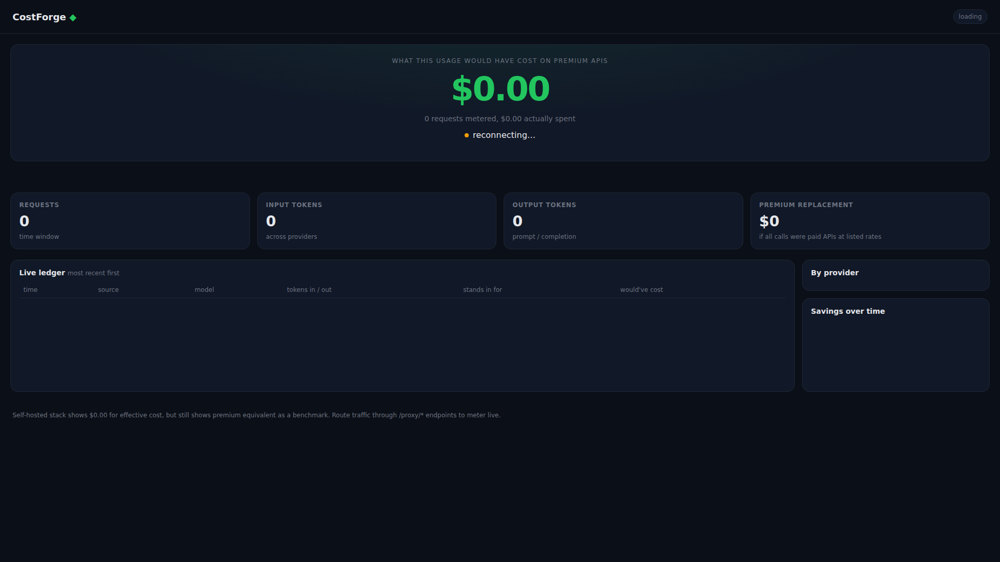
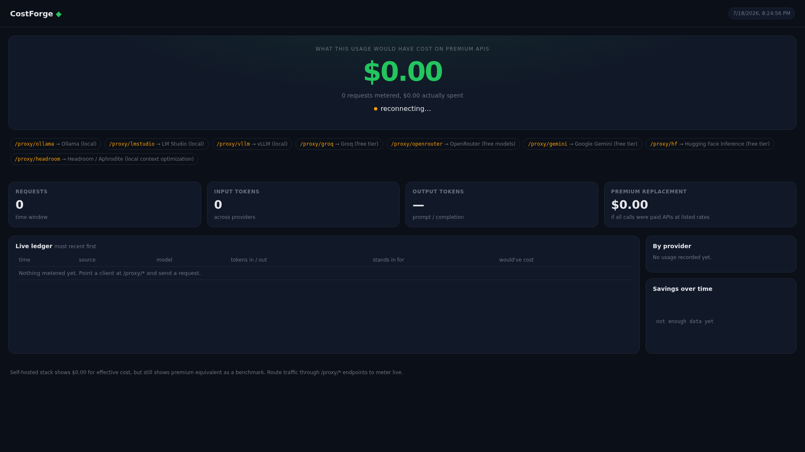

<div align="center">

  

  # 💰 CostForge

  **Self-Hosted Cloud & API Cost Estimation Dashboard**

  Track, compare, and estimate cloud/LLM API usage costs with zero external dependencies

  [](https://opensource.org/licenses/MIT)
  [](https://www.python.org/)
  [](https://fastapi.tiangolo.com/)
  [](https://www.docker.com/)
  [](https://www.sqlite.org/)

  [Features](#-features) • [Quick Start](#-quick-start) • [Architecture](#-architecture) • [API](#-api-reference) • [Contributing](#-contributing)

</div>

---

## 📸 Screenshots

<div align="center">

| Dashboard | Cost Comparison | Provider Breakdown |
|-----------|-----------------|-------------------|
|  |  |  |

</div>

> 💡 **Tip:** CostForge features a production-ready dark-themed dashboard with real-time cost tracking

---

## ✨ Features

| Feature | Description |
|---------|-------------|
| 🔍 **Multi-Provider Aggregation** | Compare pricing across AWS, GCP, Azure, OpenAI, Anthropic, and more |
| 🏠 **100% Self-Hosted** | Zero external dependencies, zero secrets in git |
| 📊 **Dark Dashboard** | Production-ready dark-themed single-page dashboard |
| 💾 **Local Storage** | SQLite for usage data, JSON for pricing catalogs |
| ⚡ **Cost Comparison** | Compare self-hosted vs premium API pricing |
| 🔌 **REST API** | Full programmatic access to cost data |
| 🐳 **Docker Deploy** | One-command deployment with Docker Compose |
| 📈 **Usage Ingestion** | Adapters normalize incoming cost/usage signals |

---

## 🚀 Quick Start

### Prerequisites

- Docker & Docker Compose
- Git

### Installation

```bash
# Clone the repository
git clone https://github.com/OneByJorah/CostForge.git
cd CostForge

# Start with Docker
docker compose up -d
```

### Access the Dashboard

Open **http://localhost:8090** in your browser

### Environment Variables

| Variable | Default | Description |
|----------|---------|-------------|
| `COSTFORGE_PORT` | `8090` | Dashboard port |
| `COSTFORGE_DB` | `./data/costforge.db` | SQLite database path |

---

## 🏗️ Architecture

```
┌─────────────────────────────────────────────────────────────┐
│                        CostForge                            │
├─────────────────────────────────────────────────────────────┤
│                                                             │
│   ┌─────────┐      ┌─────────┐      ┌─────────────────┐   │
│   │ Browser │ ───▶ │ Nginx   │ ───▶ │  FastAPI Backend │   │
│   └─────────┘      └─────────┘      └────────┬────────┘   │
│                                               │             │
│                                   ┌───────────┴───────────┐ │
│                                   │                       │ │
│                                   ▼                       ▼ │
│                            ┌──────────┐           ┌──────────┐
│                            │  SQLite  │           │   JSON   │
│                            │  Usage   │           │ Pricing  │
│                            │  Data    │           │ Catalog  │
│                            └──────────┘           └──────────┘
│                                                             │
└─────────────────────────────────────────────────────────────┘
```

### Tech Stack

| Component | Technology |
|-----------|------------|
| **Backend** | Python 3.10+, FastAPI, Uvicorn |
| **Frontend** | HTML5, CSS3, Vanilla JS |
| **Database** | SQLite 3 |
| **Reverse Proxy** | Nginx |
| **Deployment** | Docker Compose |

---

## 📁 Project Structure

```
CostForge/
├── backend/                  # FastAPI backend server
│   ├── main.py              # Application entry point
│   ├── routers/             # API route handlers
│   ├── models/              # Data models
│   └── services/            # Business logic
├── frontend/                # SPA frontend
│   ├── index.html           # Main dashboard
│   ├── css/                 # Stylesheets
│   └── js/                  # JavaScript modules
├── pricing/                 # Pricing catalog data
│   ├── aws.json             # AWS pricing
│   ├── gcp.json             # GCP pricing
│   └── llm.json             # LLM API pricing
├── scripts/                 # Utility scripts
├── docs/                    # Documentation
│   └── screenshots/         # Dashboard screenshots
├── docker-compose.yml       # Docker deployment
├── nginx.conf               # Reverse proxy config
└── stack_manifest.json      # Stack metadata
```

---

## 🔌 API Reference

| Endpoint | Method | Description | Response |
|----------|--------|-------------|----------|
| `/` | `GET` | Dashboard UI | HTML |
| `/api/costs` | `GET` | Usage cost data | JSON |
| `/api/pricing` | `GET` | Provider pricing catalog | JSON |
| `/api/compare` | `GET` | Cost comparison data | JSON |
| `/api/ingest` | `POST` | Ingest usage data | JSON |
| `/api/providers` | `GET` | List all providers | JSON |
| `/api/history` | `GET` | Historical cost data | JSON |

### Example Request

```bash
# Get current costs
curl http://localhost:8090/api/costs

# Get pricing catalog
curl http://localhost:8090/api/pricing

# Ingest usage data
curl -X POST http://localhost:8090/api/ingest \
  -H "Content-Type: application/json" \
  -d '{"provider": "openai", "model": "gpt-4", "tokens": 1000}'
```

---

## 🛠️ Development

### Local Development

```bash
# Clone the repository
git clone https://github.com/OneByJorah/CostForge.git
cd CostForge

# Install backend dependencies
cd backend
pip install -r requirements.txt

# Start development server
uvicorn main:app --reload --host 0.0.0.0 --port 8000
```

### Running Tests

```bash
# Run backend tests
cd backend
pytest

# Run with coverage
pytest --cov=. --cov-report=html
```

---

## 🤝 Contributing

Contributions are welcome! Please see [CONTRIBUTING.md](CONTRIBUTING.md) for guidelines.

1. Fork the repository
2. Create your feature branch (`git checkout -b feature/amazing-feature`)
3. Commit your changes (`git commit -m 'Add amazing feature'`)
4. Push to the branch (`git push origin feature/amazing-feature`)
5. Open a Pull Request

---

## 📄 License

This project is licensed under the MIT License - see the [LICENSE](LICENSE) file for details.

---

## 🔒 Security

For security concerns, please see [SECURITY.md](SECURITY.md).

---

## 💬 Support

- 📧 Email: support@jorah.one
- 🐛 Issues: [GitHub Issues](https://github.com/OneByJorah/CostForge/issues)
- 📖 Docs: [Documentation](docs/)

---

<div align="center">

  **Built with ❤️ by [Jhonattan L. Jimenez](https://github.com/OneByJorah)**

  [⬆ Back to Top](#-costforge)

</div>
