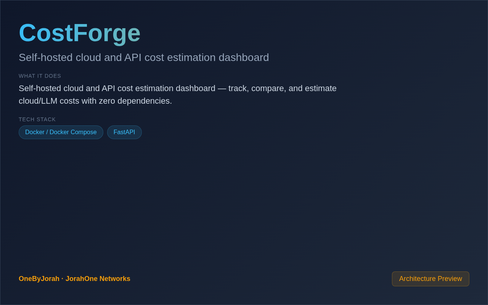

<div align="center">


# CostForge

Self-hosted cloud and API cost estimation dashboard


</div>

---

<p align="center">
  
</p>

<br>

---

## Features

- **Multi-Provider Aggregation** — Compare pricing across AWS, GCP, Azure, OpenAI, Anthropic, and more.
- **100% Self-Hosted** — Zero external dependencies, zero secrets in git.
- **Dark Dashboard** — Production-ready dark-themed single-page dashboard.
- **Local Storage** — SQLite for usage data, JSON for pricing catalogs.
- **Cost Comparison** — Compare self-hosted vs premium API pricing.
- **Real-Time Tracking** — Live cost monitoring with historical charts.
- **FastAPI Backend** — Async Python REST API with automatic OpenAPI docs.
- **Docker Compose** — One-command deployment with Nginx reverse proxy.

## Quick Start

```bash
git clone https://github.com/OneByJorah/CostForge.git
cd CostForge

cp .env.example .env  # Configure your providers
docker compose up -d
```

Open **http://localhost:3000** in your browser.

### Local Development

```bash
cd backend
pip install -r requirements.txt
uvicorn main:app --reload --port 8000

cd ../frontend
python3 -m http.server 3000
```

## Environment Variables

| Variable | Default | Description |
|----------|---------|-------------|
| `PORT` | `8000` | Backend API port |
| `DATABASE_URL` | `sqlite:///costforge.db` | Database connection string |
| `AWS_ACCESS_KEY` | — | AWS access key (optional) |
| `OPENAI_API_KEY` | — | OpenAI API key (optional) |
| `ANTHROPIC_API_KEY` | — | Anthropic API key (optional) |
| `CURRENCY` | `USD` | Display currency for cost reports |

## Architecture

```
Browser (Vanilla JS) ──API──▶ FastAPI Backend ──▶ SQLite
                                │
                                ├──▶ AWS Pricing API
                                ├──▶ OpenAI Pricing
                                ├──▶ Anthropic Pricing
                                └──▶ Custom JSON Catalogs
```

## Tech Stack

- **Backend**: FastAPI (Python 3.10+)
- **Database**: SQLite
- **Frontend**: Vanilla JavaScript (dark theme)
- **Reverse Proxy**: Nginx
- **Deployment**: Docker Compose

## Supported Providers

| Provider | Services |
|----------|----------|
| **AWS** | EC2, S3, RDS, Lambda, CloudFront |
| **GCP** | Compute Engine, Cloud Storage, Cloud Functions |
| **Azure** | VMs, Blob Storage, Functions |
| **OpenAI** | GPT-4, GPT-3.5, Whisper, DALL-E |
| **Anthropic** | Claude 3, Claude 2 |
| **Ollama** | Self-hosted models (zero cost) |

## Project Structure

```
CostForge/
├── backend/
│   ├── main.py              # FastAPI application
│   ├── adapters/            # Provider pricing adapters
│   │   ├── aws_adapter.py
│   │   ├── openai_adapter.py
│   │   ├── anthropic_adapter.py
│   │   └── ...
│   └── models.py            # Database models
├── frontend/
│   ├── index.html           # Dashboard UI
│   └── app.js               # Frontend logic
├── pricing/                 # JSON pricing catalogs
├── docker-compose.yml       # Docker deployment
├── nginx.conf               # Nginx reverse proxy
└── .env.example             # Configuration template
```

## API Reference

| Endpoint | Method | Description |
|----------|--------|-------------|
| `/api/providers` | GET | List all configured providers |
| `/api/costs` | GET | Get aggregated cost data |
| `/api/costs/history` | GET | Historical cost data |
| `/api/compare` | POST | Compare pricing across providers |
| `/api/recommend` | GET | Cost optimization recommendations |

## Contributing

Contributions are welcome. Please see [CONTRIBUTING.md](CONTRIBUTING.md) for guidelines and [CODE_OF_CONDUCT.md](CODE_OF_CONDUCT.md) for community standards.

## Security

For security concerns, see [SECURITY.md](SECURITY.md). Please report vulnerabilities to **info@jorahone.com** — do not use public issues.

## License

MIT © Jhonattan L. Jimenez

---

## 🤝 Contributing

See [CONTRIBUTING.md](CONTRIBUTING.md). All contributions follow the [Code of Conduct](CODE_OF_CONDUCT.md).

## 🔒 Security

Found a vulnerability? Please follow our [Security Policy](SECURITY.md) and report privately to `security@jorahone.com`.

## 📄 License

[MIT License](LICENSE) © Jhonattan L. Jimenez (OneByJorah)

---

<p align="center">Built with 🌴 by <a href="https://github.com/OneByJorah">OneByJorah</a> · <a href="https://jorahone.com">jorahone.com</a></p>
