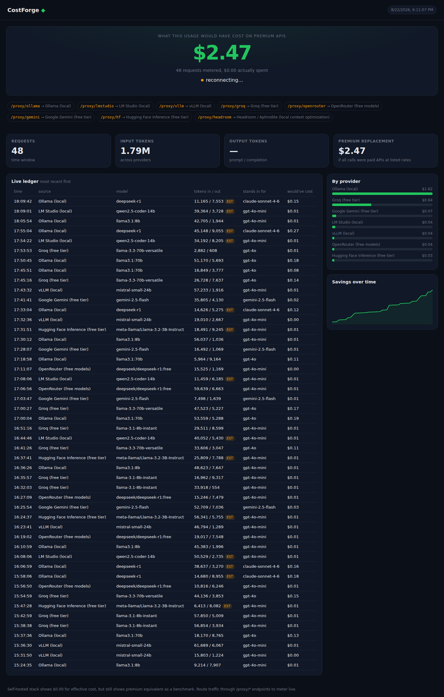

<div align="center">


# CostForge

Cloud cost analysis and optimization dashboard — track spending, identify waste, and optimize cloud bills across providers.

[](https://github.com/OneByJorah/CostForge/releases)
[](https://pypi.org/project/costforge/)
[](https://www.docker.com/)
[](https://www.python.org/downloads/)
[](https://opensource.org/licenses/MIT)

</div>



## What This Is

Cloud cost analysis and optimization dashboard — track spending, identify waste, and optimize cloud bills across providers.

Built for operators who want a self-hosted, Docker-deployed solution they control.

## Quick Start

### pip

```bash
pip install costforge
```

### Docker (recommended)

```bash
git clone https://github.com/OneByJorah/CostForge.git
cd CostForge
docker compose up -d
```

### From Source

```bash
git clone https://github.com/OneByJorah/CostForge.git
cd CostForge
pip install -r requirements.txt
python3 app.py
```

## Install

### pip

```bash
pip install costforge
```

### Docker

```bash
git clone https://github.com/OneByJorah/CostForge.git
cd CostForge
docker compose up -d
```

### From Source

```bash
git clone https://github.com/OneByJorah/CostForge.git
cd CostForge
pip install -r requirements.txt
python3 app.py
```

## Features

- **Self-hosted** — no cloud dependencies, run on your own hardware
- **Docker Compose** — full stack deployment with one command
- **pip package** — install via PyPI
- **Dark theme** — operational, clean UI

- **Multi-cloud support** — AWS, GCP, Azure cost tracking
- **Spending analysis** — breakdowns by service, team, and project
- **Waste identification** — find unused resources and over-provisioning
- **Optimization suggestions** — actionable cost-saving recommendations
- **Docker Compose deployment** — self-hosted dashboard
- **Dark theme** — financial, data-focused UI

## Tech Stack

- **Backend** — Python 3.11+, pydantic, pyyaml
- **Deployment** — Docker Compose, pip install
- **Configuration** — environment variables, config files

## Package Badges

[](https://github.com/OneByJorah/CostForge/releases)
[](https://pypi.org/project/costforge/)
[](https://www.docker.com/)
[](https://opensource.org/licenses/MIT)

## Contributing

Contributions are welcome. [Open an issue](https://github.com/OneByJorah/CostForge/issues) to report a bug or request a feature.

## License

MIT — see [LICENSE](LICENSE).
