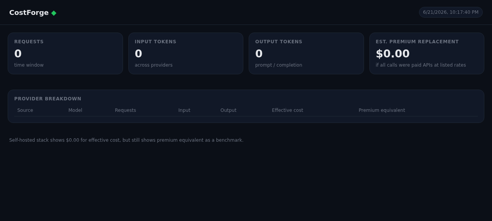

# CostForge

[](LICENSE)
[](docker-compose.yml)
[](https://www.python.org/)
[](https://fastapi.tiangolo.com/)
[](https://openrouter.ai/)

**Production-grade AI cost monitoring and optimization platform for OpenRouter.**

CostForge tracks your AI API spend in real time, detects anomalies, and provides actionable insights to cut costs — without touching your application code.



---

## Features

- **Real-Time Cost Tracking** — Live per-request spend monitoring across all OpenRouter models
- **Budget Alerts** — Configurable thresholds with Telegram and webhook notifications
- **Anomaly Detection** — ML-based spike detection that catches runaway costs early
- **Model Comparison** — Side-by-side latency, cost, and quality benchmarks
- **Token Analytics** — Prompt vs completion token breakdowns with historical trends
- **Multi-Key Support** — Manage multiple OpenRouter API keys from a single dashboard
- **Docker-Ready** — Single `docker compose up` to run in production

---

## Quick Start

### Prerequisites

- Docker Engine 24+ and Docker Compose v2
- An [OpenRouter API key](https://openrouter.ai/keys)
- (Optional) Telegram bot token for alert notifications

### 1. Clone and configure

```bash
git clone https://github.com/OneByJorah/CostForge.git
cd CostForge
cp .env.example .env
```

Edit `.env` and set your values:

```env
OPENROUTER_API_KEY=sk-or-v1-xxxxxxxxxxxx
TELEGRAM_BOT_TOKEN=123456:ABC-DEF1234ghIkl-zyx57W2v1u123ew11
TELEGRAM_CHAT_ID=987654321
BUDGET_LIMIT=50.00
BUDGET_PERIOD=daily
```

### 2. Launch

```bash
docker compose up -d
```

The dashboard is available at **http://localhost:8090**.

### 3. Verify

```bash
docker compose logs -f costforge-api
```

You should see `Uvicorn running on http://0.0.0.0:8000` confirming the API is live.

---

## Architecture

```
┌─────────────────────────────────────────────┐
│                 Frontend                    │
│          (Next.js / Vercel)                 │
└──────────────────┬──────────────────────────┘
                   │
┌──────────────────▼──────────────────────────┐
│              FastAPI Backend                 │
│  ┌─────────┐  ┌──────────┐  ┌───────────┐  │
│  │ Tracker  │  │ Anomaly  │  │  Budget   │  │
│  │ Service  │  │ Detector │  │  Alerts   │  │
│  └────┬─────┘  └────┬─────┘  └─────┬─────┘  │
│       │              │              │        │
│  ┌────▼──────────────▼──────────────▼─────┐  │
│  │          SQLite / PostgreSQL           │  │
│  └────────────────────────────────────────┘  │
└──────────────────────────────────────────────┘
                   │
          ┌────────▼────────┐
          │   OpenRouter    │
          │   API Gateway   │
          └─────────────────┘
```

---

## Configuration

All configuration is via environment variables (see `.env.example`).

| Variable | Default | Description |
|---|---|---|
| `OPENROUTER_API_KEY` | — | Your OpenRouter API key |
| `DATABASE_URL` | `sqlite:///./costforge.db` | Database connection string |
| `BUDGET_LIMIT` | `50.00` | Budget threshold amount |
| `BUDGET_PERIOD` | `daily` | `daily`, `weekly`, or `monthly` |
| `TELEGRAM_BOT_TOKEN` | — | Telegram bot token for alerts |
| `TELEGRAM_CHAT_ID` | — | Telegram chat ID for alerts |
| `PORT` | `8000` | API server port |

---

## Development

### Local setup (without Docker)

```bash
python -m venv .venv
source .venv/bin/activate   # Windows: .venv\Scripts\activate
pip install -r requirements.txt
uvicorn app.main:app --reload --port 8000
```

### Run tests

```bash
pytest
```

### Lint

```bash
ruff check .
```

---

## Screenshots

| Dashboard | Cost Breakdown | Provider Comparison |
|---|---|---|
|  |  |  |

---

## Roadmap

- [ ] Prometheus metrics export
- [ ] Grafana dashboard template
- [ ] Slack/Discord alert integrations
- [ ] CSV/PDF report generation
- [ ] Multi-user support with API keys

---

## Contributing

Contributions are welcome! Please see [CONTRIBUTING.md](CONTRIBUTING.md) for guidelines.

1. Fork the repo
2. Create a feature branch (`git checkout -b feat/amazing-feature`)
3. Commit with conventional format (`feat:`, `fix:`, `chore:`)
4. Push and open a PR

---

## License

MIT — see [LICENSE](LICENSE) for details.

---

<p align="center">
  Built with care by <a href="https://github.com/OneByJorah">OneByJorah</a>
</p>
