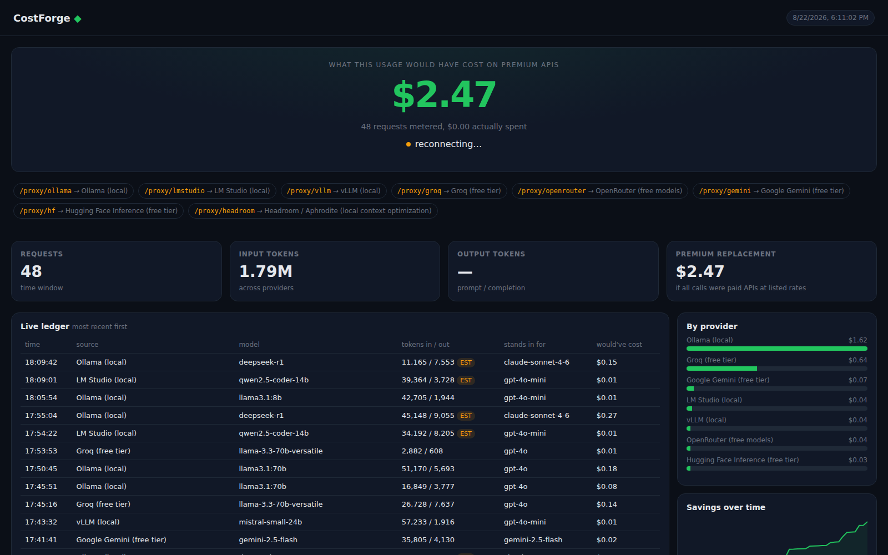
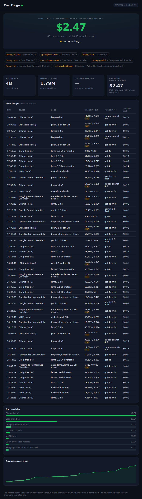
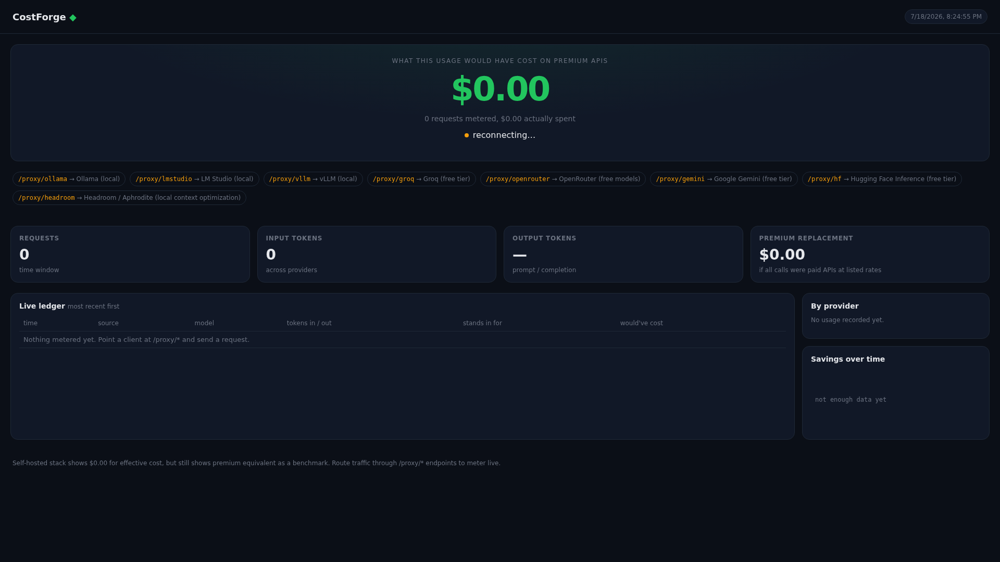

<div align="center">


# CostForge

**Self-hosted cost observability for local and free-tier LLM APIs — a transparent proxy that meters every request and shows what it *would* have cost on premium models.**

<a href="https://github.com/OneByJorah/CostForge/stargazers"></a>
<a href="https://github.com/OneByJorah/CostForge/commits"></a>


</div>


## What This Is

Running local models (Ollama, LM Studio, vLLM) or free-tier APIs (Groq, Gemini free, HuggingFace) keeps the bill at zero — but it hides the volume, token counts, and commercial value of that traffic. CostForge sits in front of those providers as a transparent HTTP reverse proxy, parses each response, and prices the usage against a premium-model catalog so you can quantify what you saved.

Point a client at CostForge instead of the provider and it meters automatically. No application instrumentation and no SDK required.

## Quick Start

```bash
git clone https://github.com/OneByJorah/CostForge.git
cd CostForge
cp .env.example .env
docker compose up -d
```

Open **http://localhost:8090** for the dashboard. The API listens on **http://localhost:8000**.

> [!NOTE]
> The Docker daemon must be running before `docker compose up -d`. If you prefer the one-liner installer, `./install.sh` copies `.env` and builds both services.

## Features

- **Zero-friction metering proxy** — point your client at `/proxy/<provider>` and every request is logged; no code changes.
- **Premium-equivalence costing** — maps local/free models (e.g. `llama3.1:8b` → `gpt-4o-mini`) to per-million-token rates in `pricing/catalog.json`.
- **Live WebSocket feed** — new usage records broadcast to the dashboard instantly, with reconnect built in.
- **Provider catalog** — Ollama, LM Studio, vLLM, Headroom, Groq, OpenRouter free, Google Gemini free, and Hugging Face in `backend/providers.json`.
- **External ingestion** — adapters push non-proxied usage (Hermes, GitHub, Telegram, OpenRouter) into the same store via `POST /ingest`.
- **Time-series analytics** — per-source breakdowns, token splits, sparklines, and recent-request views.
- **SQLite with WAL** — zero external dependencies, persisted in the `costforge-data` Docker volume.
- **Hardened deployment** — non-root backend container, healthchecks, and CodeQL analysis in CI.

## Architecture

```
Browser ──▶ nginx (port 8090) ──▶ FastAPI backend (port 8000)
                                     │
                            ┌────────┴────────┐
                            ▼                 ▼
                       SQLite (usage)   JSON catalogs
                            │            (providers, pricing)
                            ▼
                  WebSocket live feed (/ws)
```

The frontend is a pre-built static SPA served by nginx; nginx also proxies `/api/`, `/ingest`, `/proxy/`, and `/ws` through to the backend.

## Configuration

All runtime settings come from `.env` (see `.env.example`).

| Variable | Default | Description |
|----------|---------|-------------|
| `COSTFORGE_LOG` | `/app/usage.jsonl` | Path to the append-only usage log |
| `COSTFORGE_DB` | `/app/data/costforge.db` | SQLite database file |
| `BACKEND_PORT` | `8000` | FastAPI host port |
| `FRONTEND_PORT` | `8090` | nginx dashboard host port |

Pricing baselines live in `pricing/catalog.json` and `backend/pricing.json`; provider definitions (with premium-equivalent mappings) live in `backend/providers.json`.

## API Endpoints

| Endpoint | Method | Description |
|----------|--------|-------------|
| `/healthz` | GET | Liveness probe for the backend |
| `/ingest` | POST | Accept a usage record from an external adapter |
| `/api/usage` | GET | Raw usage records (`?days=30`) |
| `/api/summary` | GET | Per source/model rollup (`?days=7`) |
| `/api/stats` | GET | Totals and per-provider breakdown |
| `/api/recent` | GET | Most recent records (`?limit=50`) |
| `/api/timeseries` | GET | Bucketed cost/requests (`?rangeMinutes=120`) |
| `/api/providers` | GET | Configured provider catalog |
| `/api/pricing` | GET | Premium pricing reference |
| `/proxy/{provider_id}/{path}` | ANY | Metered passthrough to a provider |
| `/ws` | WebSocket | Live usage feed |

## Use Cases

1. **Homelab operators** — justify GPU spend by quantifying the commercial value of local inference.
2. **Platform teams** — track aggregate LLM usage across a heterogeneous provider mix from one pane.
3. **Cost owners** — review token trends and per-model opportunity cost without opening provider billing portals.

## Tech Stack

FastAPI, uvicorn, httpx, SQLite (WAL), nginx, vanilla JS SPA, Docker Compose, CodeQL.

## Development

```bash
cd backend
python -m venv .venv && source .venv/bin/activate   # Windows: .venv\Scripts\activate
pip install -r requirements.txt
uvicorn main:app --reload --port 8000
```

## Screenshots

| Dashboard | Providers | Comparison |
|---|---|---|
|  |  |  |

More captures live in [`docs/screenshots/`](docs/screenshots/).

## Contributing

Contributions are welcome — see [CONTRIBUTING.md](CONTRIBUTING.md). [Open an issue](https://github.com/OneByJorah/CostForge/issues) to report a bug or request a provider adapter.

## License

MIT — see [LICENSE](LICENSE).

## Connect

- [jorahone.com](https://jorahone.com)
- [GitHub Org](https://github.com/OneByJorah)
- [info@jorahone.com](mailto:info@jorahone.com)
